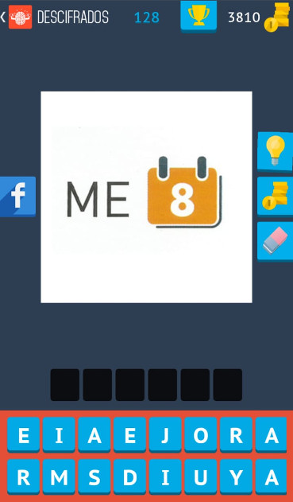
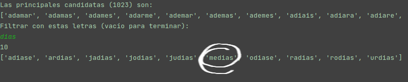
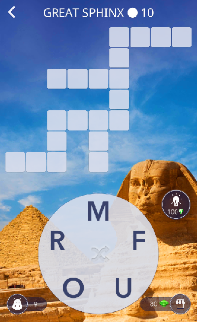
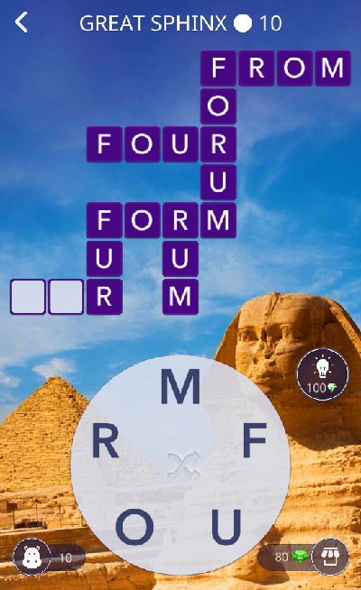

# Palabrotas

***


## A program to help you solve rebus puzzles and anagrams


[Image from](https://en.wikipedia.org/wiki/File:Top_Secret_Rebus_Puzzle.png)  

You must provide the letters that and the length of the word.
The script will either combine them and produce every possible word or use a
dictionary
to output only "valid" words (faster and very little memory usage).

## Contents
* [Palabrotas](./palabrotas/README.md#palabrotas)
  * [A program to help you solve rebus puzzles and anagrams](./palabrotas/README.md#a-program-to-help-you-solve-rebus-puzzles-and-anagrams)
  * [Running palabrotas.py](./palabrotas/README.md#running-palabrotaspy)
  * [Usage](./palabrotas/README.md#usage)
            * [Choose mode](./palabrotas/README.md#choose-mode)
            * [Letters](./palabrotas/README.md#letters)
            * [Word length](./palabrotas/README.md#word-length)
    * [Complete mode](./palabrotas/README.md#complete-mode)
    * [Dictionary mode](./palabrotas/README.md#dictionary-mode)
    * [Filter](./palabrotas/README.md#filter)
  * [Use cases](./palabrotas/README.md#use-cases)
    * [Rebus puzzles](./palabrotas/README.md#rebus-puzzles)
    * [Anagrams](./palabrotas/README.md#anagrams)
    * [Unexpected uses](./palabrotas/README.md#unexpected-uses)
      * [Your kids' homework](./palabrotas/README.md#your-kids-homework)
      * [Golden gate vectors design](./palabrotas/README.md#golden-gate-vectors-design)
  * [Language](./palabrotas/README.md#language)
    * [Building your dictionary](./palabrotas/README.md#building-your-dictionary)
      * [Spanish](./palabrotas/README.md#spanish)
      * [English](./palabrotas/README.md#english)
  * [TODO](./palabrotas/README.md#todo)

## Running palabrotas.py

You can clone this repository with either of these options:

```bash
# HTTPS
git clone https://github.com/aeu79/palabrotas.git
# SSH
git clone git@github.com:aeu79/palabrotas.git
# GitHub CLI
gh repo clone aeu79/palabrotas
```

And run it:

```bash
cd palabrotas && python3 palabrotas.py
```

Or just copy the script:  
[Raw version](https://raw.githubusercontent.com/aeu79/palabrotas/main/palabrotas.py)
and the [files](files) folder (which contains the dictionaries). And then run
it: `python3 /your/path/to/palabrotas.py`

## Usage

#### Choose mode

First, you will be prompted to choose between the complete (press "c") or  
dictionary (leave empty) modes.

#### Letters

After pressing enter, you have to input the letters. Every letter is used
only once, so you need to repeat them as many times as you might need.

#### Word length

Enter the word length and press enter.

### Complete mode

In the complete mode, every possible combination is generated. Please, be
aware  that (at least in my laptop) words of length >14 letters can hang the
system. Twelve letters long words generate almost 17 million possible
outcomes. For long words, use only the dictionary mode.  

```
Ingrese "c" para modo completo (generar todos los posibles valores) o nada para modo "diccionario" (ingrese "h" para ayuda)
Modo: c
Eligió modo completo
Ingrese las letras combinables y palabras para usar enteras después de una "/" (nada para terminar).
Letras: aeiban
Longitud de la palabra: 3
completo
Son 72 posibilidades.Tardó 0.0 segundos en combinarlas.
Las principales candidatas (6) son: 
{'iba', 'ine', 'nia', 'ben', 'nea', 'ana'}
Filtrar con estas letras (vacío para terminar):

Quiere ver el resto? (s/n) s
{'ani', 'eia', 'bai', 'aan', 'nbi', 'nia', 'ibn', 'bae', 'nie', 'anb', 'nea', 'eab', 'aba', 'ieb', 'abe', 'nei', 'naa', 'aib', 'bia', 'bei', 'abn', 'aeb', 'inb', 'ein', 'bni', 'nba', 'aea', 'enb', 'ain', 'bea', 'ean', 'ane', 'nab', 'aae', 'aie', 'aai', 'ibe', 'bne', 'eai', 'ine', 'baa', 'aia', 'abi', 'nai', 'iab', 'bna', 'eib', 'eba', 'aen', 'iea', 'bie', 'ebi', 'ena', 'ana', 'iba', 'ban', 'iaa', 'nae', 'neb', 'ian', 'bin', 'nib', 'ebn', 'ien', 'eaa', 'aei', 'nbe', 'ben', 'aab', 'iae', 'eni', 'ina'}
```

### Dictionary mode

In the dictionary mode, only words containing the letters introduced are
used, which saves a lot of memory and CPU.

```
El diccionario tiene 917580 palabras.

Ingrese "c" para modo completo (generar todos los posibles valores) o nada para modo "diccionario" (ingrese "h" para ayuda)
Modo: 
Eligió modo diccionario
Ingrese las letras que deben formar las palabras.
Letras: aspltabaro
Longitud de la palabra: 10
diccionario
aspltabaro
{'p', 'b', 'r', 'l', 'o', 't', 'a', 's'}
[1, 1, 1, 1, 1, 1, 3, 1]
215
1
Las principales candidatas (1) son: 
['palabrotas']
Filtrar con estas letras (vacío para terminar):
```

### Filter

Independently of the mode, the program will try to identify the main
candidates by filtering with the dictionary. Those words will be on top.
Still you will be prompted to choose a filter or leave it empty (and press
enter) to finish. Filtering allows to use some letters that are
for example pretty clear from the image of a rebus or a known syllable  from
the anagram.

## Use cases

### Rebus puzzles



Screenshot of [Apalabrados (Word Crack)](https://play.google.com/store/apps/details?id=com.etermax.apalabrados.lite&hl=es&gl=US)

Answer:


### Anagrams



Screenshot of [Word of wonder)](https://play.google.com/store/apps/details?id=com.fugo.wow&hl=en&gl=US)

Letters: M F U O R

```
Main candidates with 5 letters:
['forum']
...
Main candidates with 4 letters:
['form', 'four', 'from']
...
Main candidates with 3 letters:
['for', 'fou', 'fro', 'fum', 'fur', 'mfr', 'our', 'rom', 'rum']
```



And "for"... 🎉

### Unexpected uses

#### Your kids' homework

Good to find what words they can make using their names' letters.

```
Letras: Dogual 
['adulo', 'agudo', 'aludo', 'dogal', 'laudo']
...
Letras: Liam
['ilma', 'lami', 'lima', 'mali']
```

#### Golden gate vectors design

Get all possible combinations of ACTG taken 3 at a time:

```
Letras: ACTG
Longitud de la palabra: 3
...
{'cgt', 'atc', 'tga', 'cga', 'gac', 'cta', 'gca', 'ctg', 'agc', 'atg', 'gtc', 'cat', 'tcg', 'tgc', 'agt', 'tac', 'act', 'cag', 'gat', 'tca', 'gct', 'tag', 'gta', 'acg'}
```

## Language  

The language of the dictionary can be Spanish:

```bash
python3 palabrotas.py -es
```  

or English (default):

```bash
python3 palabrotas.py -en
```  

*Svenska kommer snart*  🤞

### Building your dictionary

Install hunspell-tools: ```sudo apt install hunspell-tools```

#### Spanish

Instruction to get a dictionary (with verbs conjugated):
Clone the repository: ```git clone https://github.com/sbosio/rla-es.git &&
cd ./rla-es/ && git pull```  

Generate the words (unmunch diccionario.dic afijos.aff):

```bash
unmunch './ortograf/herramientas/es_ANY.dic' './ortograf/herramientas/es_ANY.aff' > 'palabras_todas.txt'
```

Remove the "acentos" á, é, í, ó, ú:

```
sed -r 's/á/a/g;s/Á/a/g;s/É/e/g;s/é/e/g;s/Í/i/g;s/í/i/g;s/Ó/o/g;s/ó/o/g;s/Ú/u/g;s/ú/u/g' palabras_todas.txt > palabras.txt
```

Remove uppercase:

```
sed -i 's/\(.*\)/\L\1/' palabras.txt
```

And compress it (with python 😅):

```
python3 -m zipfile -c palabras_es.zip palabras.txt
```

#### English

```bash
wget https://archlinux.org/packages/extra/any/hunspell-en_gb/download/
unmunch en_GB-large.dic en_GB-large.aff > palabras.txt
zip palabras_en.zip palabras.txt
```

## TODO

* [x] Document the usage in the readme  
* [ ] Translate code comments to English  
* [x] Add the option to run it in Spanish/English  
* [ ] Automate dictionary creation/update  

TOC created using [gh-md-toc](https://github.com/ekalinin/github-markdown-toc)
